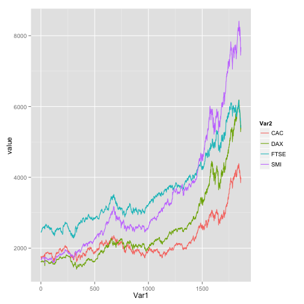

Correlation Between European Stock Prices
========================================================
author: Tong Wang
date: Jan 25, 2015

Bulls and bears: together, not the same
========================================================
Stock prices around the world often rise and fall together. See below a plot of the daily closing prices of four major European stock indices: Germany DAX (Ibis), Switzerland SMI, France CAC, and UK FTSE from 1991 to 1998:
 

Bulls and bears: together, not the same (cont'd)
========================================================
We see that the four stock indices in general move hand in hand with each other. But how much exactly do they correlate with their European peers? We have built an app to help you investiage this.

Sneak preview:
https://tongwang.shinyapps.io/DevelopingDataProducts/

Specs
========================================================
As a user, you can select:
 - A target stock index (e.g. DAX)
 - A date range between 1 and 1086 (e.g. 10 to 950)
 
The application will then fit a linear regression model with the other three indices on the selected dates as predictors. The following are reported:
 - Model R squared
 - Plot of fitted and actual value

Conclusion
========================================================
You will see that all four indices show a very high correlation with the performace of the other Euorpean markets.

Enjoy!

https://tongwang.shinyapps.io/DevelopingDataProducts/
